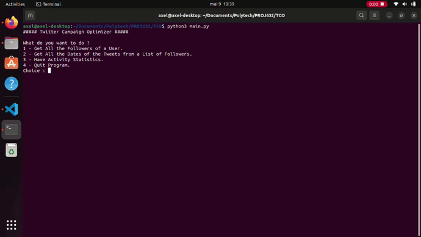
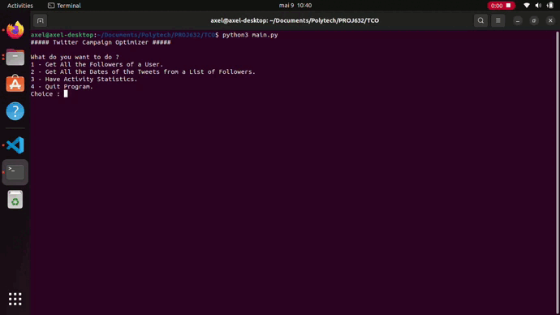

## Introduction
In this project, the goal is to find, for a given Twitter user, the period of the year, week and day when his followers are most active. Once this period is found, the user in question will be able to promote his content in an optimal way during this period. The activity is calculated according to the date and time of the Tweets, RTs and Replies made by all his followers.

## How Does It Works ?
In order to use the code correctly, we invite you to follow the few steps below :
1. Run the program.
2. Follow the instructions provided by the program.

The GIF below illustrates the different steps detailed above :

Mode No. 1 :

Mode No. 2 :

Mode No. 3 :

## Version
Made with Python 3.10.0 & TwitterAPI v1 & TwitterAPIv2
